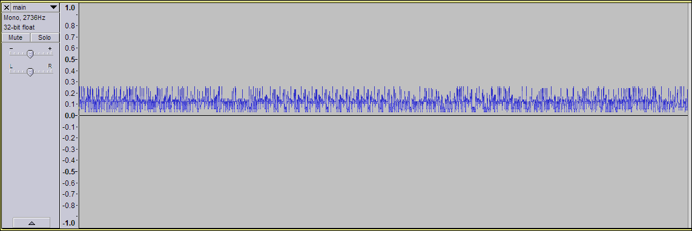
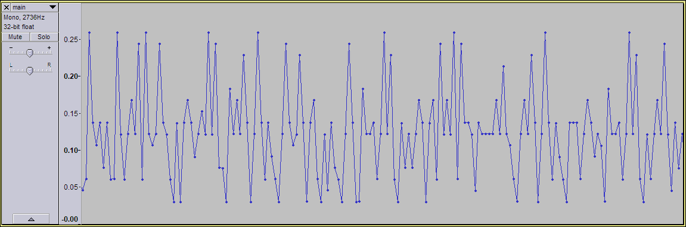
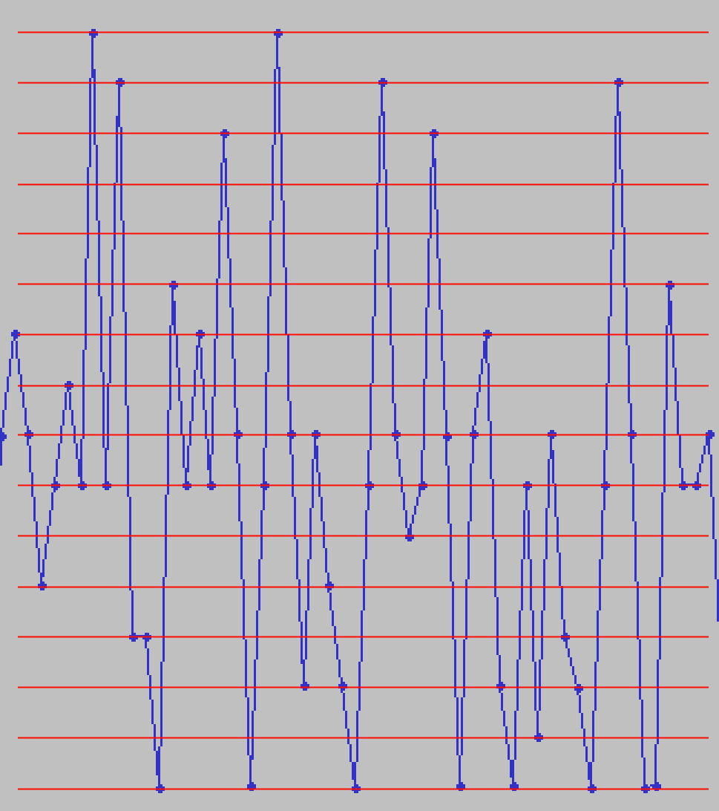

# Surfing the Waves

picoCTF 2021 - Forensics - 150 points\
(250 points post-contest)

> While you're going through the FBI's servers, you stumble across their incredible taste in music. One `main.wav` you found is particularly interesting, see if you can find the flag!
>
> Hints:
>
> - Music is cool, but what other kinds of waves are there?
> - Look deep below the surface

Provided file: `main.wav`

Prerequisite topics: [Number bases](https://www.mathsisfun.com/numbers/bases.html), [Ascii](http://www.asciitable.com/)

## Investigation

Playing the audio results in nothing interesting, so we'll open the file in [Audacity](https://www.audacityteam.org/) just to see if we can find anything.



If you have no clue what an audio waveform represents, you can look at [this website](https://pudding.cool/2018/02/waveforms/). However, it's not really relevant as you'll see soon.

It's a bit suspicious that the waveform is entirely positive. Again, you don't really need to know that because the most important part about this waveform is what you see when you zoom in.



Here's something really important to know whenever you're doing forensics or cryptography in a CTF:

## Bits of ASCII Alphabet Characters are Extremely Repetitive.

(Seriously, New Vignere in the very same contest relies on this trick as well.)

See how points on the waveform seem to be randomly scattered vertically, except for two specific values that the wave always seems to come back to? Now look at this table for the hex ASCII values of the alphabet.

Char | Hex | | Char | Hex
-|----|-|-|----
a| 61 | |n| 6E
b| 62 | |o| 6F
c| 63 | |p| 70
d| 64 | |q| 71
e| 65 | |r| 72
f| 66 | |s| 73
g| 67 | |t| 74
h| 68 | |u| 75
i| 69 | |v| 76
j| 6A | |w| 77
k| 6B | |x| 78
l| 6C | |y| 79
m| 6D | |z| 7A

Perhaps you notice what I'm getting at?

Look at the waveform again. Here's something else to notice: the heights of all the points are actually not that random, they look quantized. That is to say all points appear to be at one of many fixed amplitude levels (this is especially noticeable near the middle, you can almost see rows of points lined up). This isn't a result of zooming in a lot and losing precision, you can tell because if you zoom in further you can see there is actually a tiny bit of random variation.

Now, how about we try something. Let's count how many of these fixed amplitude levels there are.



There are 16 different levels (2 were not visible in the part I selected, but they're very evenly spaced so we can assume). That should immediately be suggesting hex to us.

In addition, if we let the lowest one be 0 and count up, we see that the large clusters of points are around 6 and 7... (if you have a bad memory, scroll back up to the table and look at the first hex digit)

## I Hope Nobody Transcribed it Manually

We want to extract a numerical value for each sample (each point) in the file, so that everything can be converted to hex. Quickly searching, [this Stack Overflow thread](https://stackoverflow.com/questions/3059089/how-to-get-wav-samples-from-a-wav-file) and [this Python standard library module](https://docs.python.org/3/library/wave.html) seem useful for manipulating wave files.

```py
import array
import binascii
import wave

with wave.open("main.wav", "rb") as w:
    # from stackoverflow: try "B", "H", "L"
    # "H" produces very neat results
    arr = array.array("H", w.readframes(w.getnframes()))

    # array('H', [2000, 2501, 2009, 1509, 2008, 8507, 4508,
    # 3505, 4505, 2505, 4505, 2000, 2009, 8509, 4000, 2003,
    # 4003, 5505, 4003, 8008, 2003, 8502, 4009, 3509, 4002,
    # 8000, 4508, 4000, 2002, 1006, 4500, 1001, 4502, 5509,
    # 4507, 3000, 4008, 5004, 4001, 8503, 4000, 8006, 2507,
    # ...
```

It looks like each point is around a multiple of 500 plus a tiny amount of  random variation as mentioned. It also turns out that the lowest point is around 1000. The hex directly decodes to text, which contains the flag.

```py
# convert so that they are all integers in range(0, 16)
hex_list = [round((x-1000)/500) for x in arr]

hex_str = "".join(["0123456789abcdef"[x] for x in hex_list])

print(binascii.unhexlify(hex_str).decode())
```

Side note: I have *no clue* what the hints are referencing.
