# Very Very Very Hidden

picoCTF 2021 - Forensics - 300 points

> Finding a flag may take many steps, but if you look diligently it won't be long until you find the light at the end of the tunnel. Just remember, sometimes you find the hidden treasure, but sometimes you find only a hidden map to the treasure.
>
> Hints:
>
> - I believe you found something, but are there any more subtle hints as random queries?
> - The flag will only be found once you reverse the hidden message.

Provided file: `try_me.pcap`

## Wireshark

A bit of background first: data transmitted over networks are split up into smaller packets of data, which are sent individually. The `.pcap` file given is a packet capture file, and is a record of all packets sent and received by a certain computer over some period of time. A free, open source, cross platform GUI program that can view these files is Wireshark.

Since packets are relatively small, a single conversation or interaction between two computers can span many packets of data. However, if a computer is having multiple conversations at once, a chronological list of packets sent and received (as Wireshark will first show you) is not too helpful. Fortunately, we can easily get Wireshark to show us only one conversation at a time by going into `Analyze > Follow` (on the menu bar) and picking one of the options (in this case, TCP Stream). If picoCTF has taught me anything, it's that you should always look at the conversation streams when given a pcap file.

Looking through the various conversations (by changing the stream number in the bottom right) in ASCII form, there appears to be a lot of encrypted data. However, when we get to TCP stream 5, we can see an HTTP request is being made:

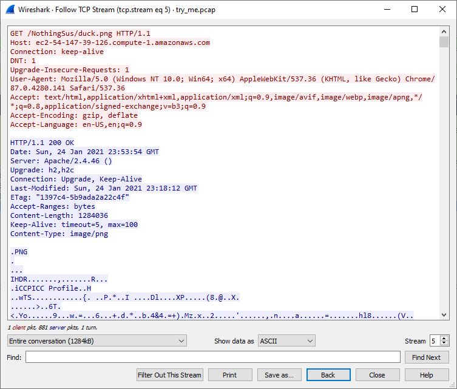

The red text indicates what the client requested, `GET /NothingSus/duck.png`, and the blue text shows the response. Several headers are sent, followed by a blank line, and then the response body. A PNG image is in the body. This is interesting, so we'll switch the format from `ASCII` to `Raw` and `Save As` with the name `duck.png`. I opened the resulting file in a hex editor and cut off the first `0x31F` bytes, which are just the HTTP headers (we only want the response body, the PNG file. The resulting file should start with `89 50 4E 47` (.PNG), and the last bytes being cut off should be `0D 0A 0D 0A`).

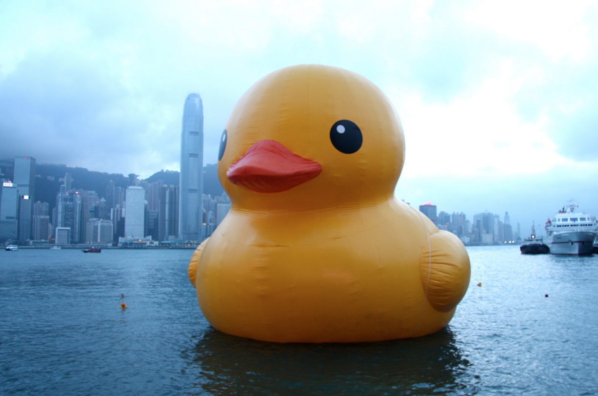

Switching back to ASCII, there isn't much interesting content until TCP stream 34, where we see another PNG file in a similar format as before. This time the request made was `GET /NothingSus/evil_duck.png`. Repeating the process, we save the file as `evil_duck.png`, cut off the first `0x324` bytes of HTTP headers, and get this image:

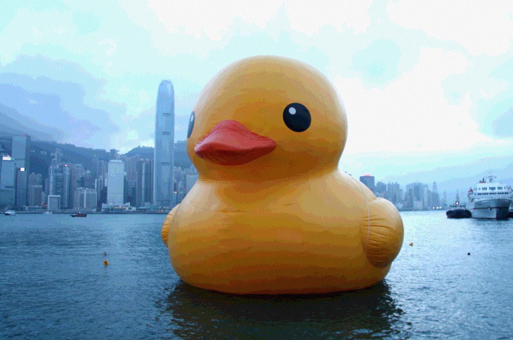

## Image Depth

Comparing `evil_duck` and `duck`, perhaps the most obvious difference we can see is over regions of smooth gradients (such as the sky and the body of the duck) in the original image. `evil_duck` introduces the existence of bands or lines of solid colour, and appears much less smooth. This effect is unsurprisingly called [colour banding](https://en.wikipedia.org/wiki/Colour_banding) and is a result of insufficient colour depth, which is just the number of bits used to store each pixel. If there are only a few bits available, only a small number of colours can be encoded, which leads to low quality transitions. For example, a standard RGB 24 bit png uses 8 bits to store each of the red, green, and blue channels, and allows for `2**24 = 16777216` colours, while an 8 bit image can only encode `2**8 = 256` different colours<sup id="a1">[1](#f1)</sup>. Here's a visual explanation of what's going on.

Suppose we have a grayscale image with 8 bits per pixel. Then each pixel is a value from 00-ff, with `0x00` being full black and `0xff` being full white. If we were to draw a gradient using these 256 shades, we would get something like below. The difference between one shade and the next, like `0x7e` and `0x7f`, is only perceptible when zoomed in, because there is very fine control.

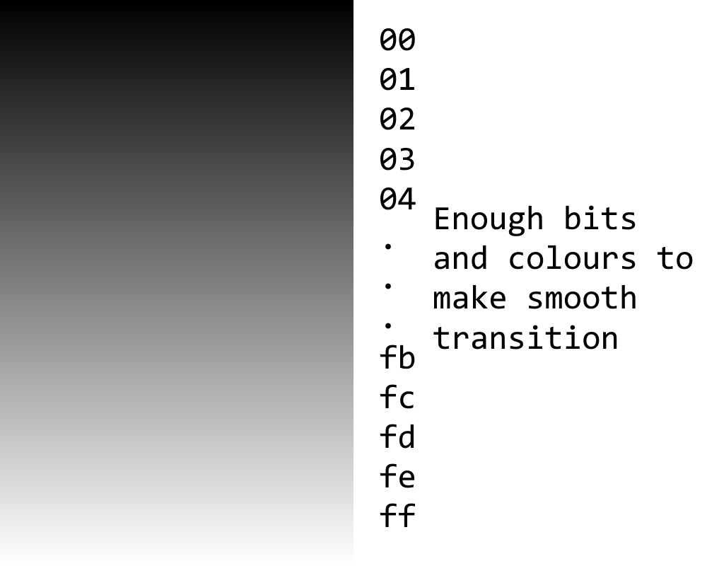

Now if we only had 4 bits per pixel, there are only 16 possible shades (`0x0` to `0xf`). The values will still be an even interpolation between black and white, so `0x1` would be `0x11` in the 8 bit system, `0x2` would be `0x22`, and so on until `0xf` is `0xff`. Note that this looks very similar to, and is essentially the same concept as, dropping the 4 least significant bits of each pixel in the 8 bit image, which would map colours like `0xd4` and `0xdb` both to `0xd0`, producing an image with only 16 distinct colours, just like the 4 bit image. You can think of the 8 bit image like being able to choose from 256 different points between 0 and 1 (black and white), while the 4 bit image throws away all but 16 of those points, forcing you to make large jumps in shades. All the detail is lost.

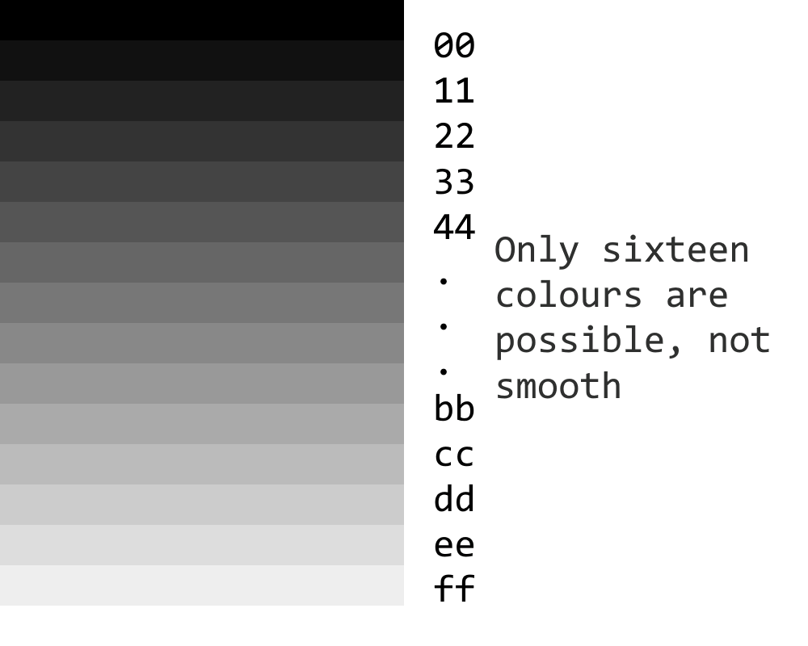

## Steganography?

So, when we get bands in the image like with `evil_duck`, it suggests to us that the least significant bits have been dropped, and all the detailed colour information is gone, which makes it impossible to have a smooth transition. However, if we zoom in, we see that this isn't really colour banding:

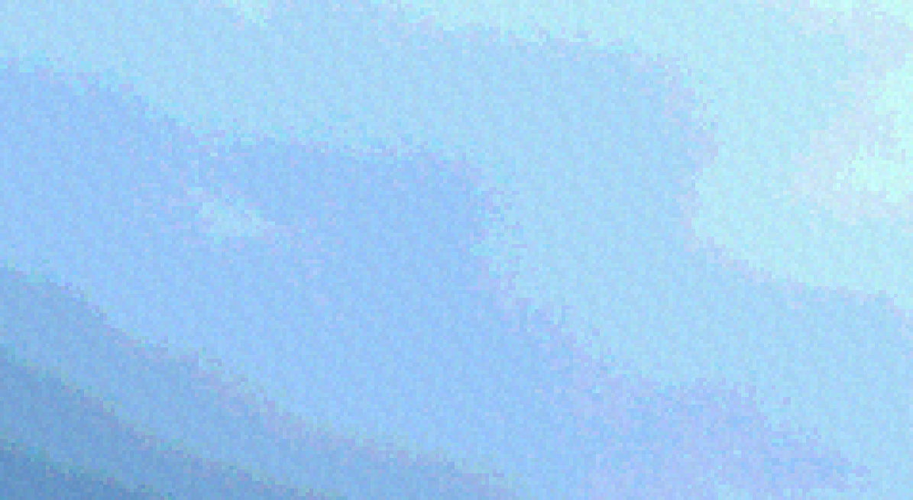

Though the bands look somewhat like solid colours from afar, they are actually made up of many slightly different colours. Something strange we can also see is that it almost looks like some sort of repeated texture pattern is being applied to the whole image.

What we can conclude from this is that the least significant bits of the image have been messed with. Zoomed out, it looks like there is colour banding, which implies that the least significant bits have been completely removed, limiting the precision and reducing the total number of possible colours. However, zoomed in, there are subtle changes in colour which suggest that the least significant bits are still there, but the original colours have been replaced with a pattern. This definitely warrants a closer look.

Here's what this might look like as an extension of the previous series of examples.

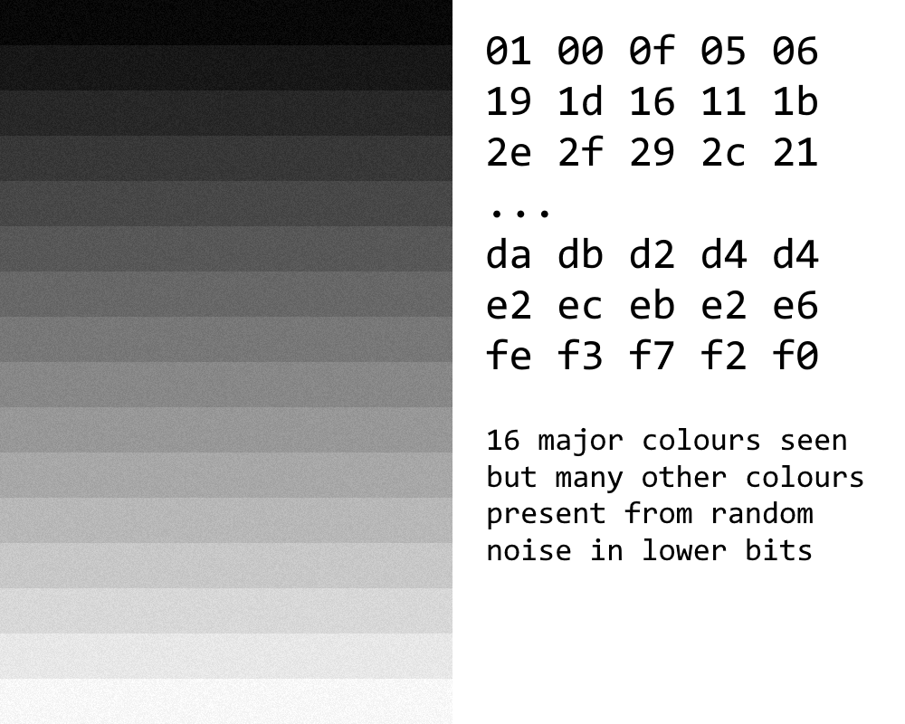

## Steganography `->` Stegsolve

[Stegsolve](http://www.caesum.com/handbook/stego.htm) is a very useful program for any forensics challenges involving images. With Stegsolve, we can view the individual bit planes of each channel. What this means is we take a specific colour channel, like red, and take a specific bit from each pixel's red value, such as the least significant bit. This will either be 0 or 1, and assigning 0 to black and 1 to white for every pixel gives us an image.

Opening `evil_duck.png` and moving through the different modes with the arrow keys, everything looks normal until we reach red plane 3.

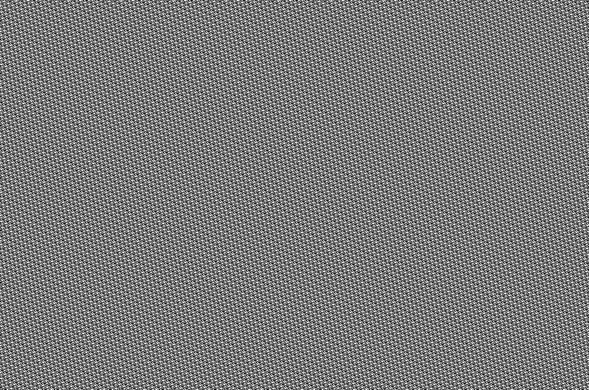

Continuing through, it seems that the lesser significant half of each colour channel's bytes has been replaced with this pattern, confirming our visual inspection from earlier.

For comparison, a regular picture's least significant bits should look like random noise because they'll just be slight fluctuations between colours next to each other, while the most significant bits should give large patches according to the colour of the region, because changing the most significant bits completely changes the colour. Here are all the bit planes for the red channel of duck.png, which seems to be a normal image:

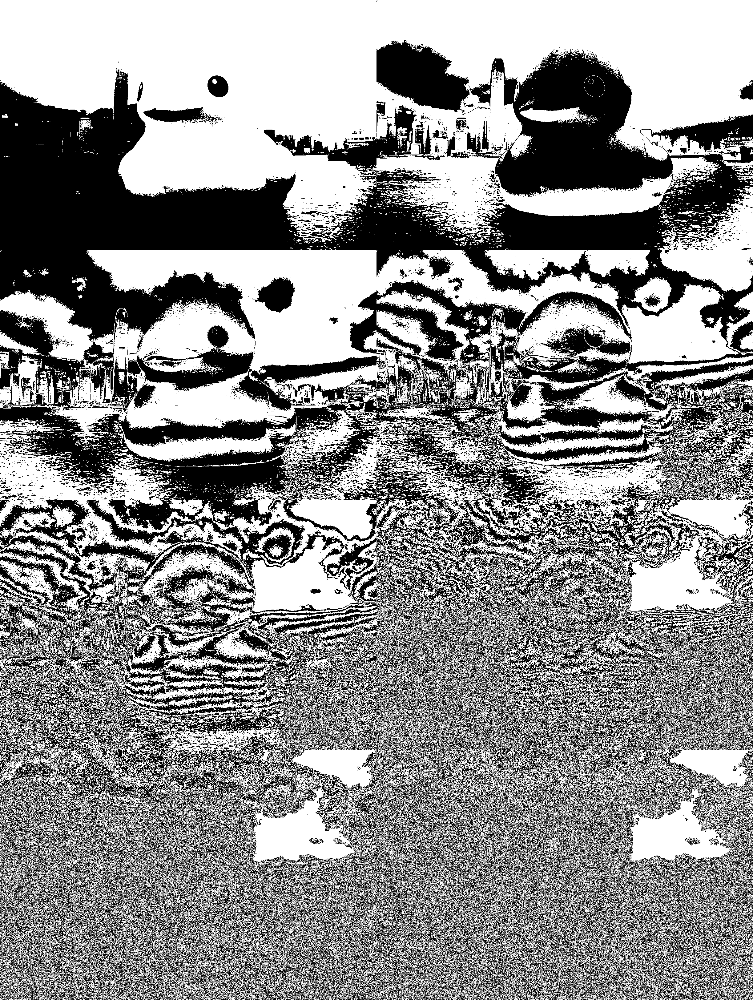

(recommended to view in 100% zoom to get rid of any moiré effect)

I wasn't really sure how to continue from here during the contest since there wasn't anything obvious that could hide a flag in these patterns. I checked the packet capture for any other useful information since one of the hints seemed to suggest there was some information in "random queries," but I didn't find anything.

What I decided to do next was see if the pattern truly repeated, or whether there were a few breaks in the pattern. I also decided to combine the 4 bit channels for each colour together so that I only needed to deal with 3 patterns instead of 12 (I just ~~hoped~~ assumed that the challenge wouldn't put anything in a specific bit plane).

To read the image, I used [Pillow](https://pypi.org/project/Pillow/).

```py
from PIL import Image

im = Image.open("evil_duck.png")
reds = []
greens = []
blues = []

for y in range(im.height):
    for x in range(im.width):
        p = im.getpixel((x, y))
        # take the 4 least significant bits of
        # each channel of each pixel
        reds.append(p[0] & 0b1111)
        greens.append(p[1] & 0b1111)
        blues.append(p[2] & 0b1111)

with open("red", "w") as f:
    f.write(str(reds))
with open("green", "w") as f:
    f.write(str(greens))
with open("blue", "w") as f:
    f.write(str(blues))
```

Upon opening the red channel file in vscode and highlighting the start, we can see a bunch of duplicate strings being highlighted as well. Unfortunately, vscode [stops highlighting duplicate strings after 200 characters](https://github.com/microsoft/vscode/issues/111002) but it's enough to show us a repeating pattern in the red channel:

```txt
9, 3, 4, 9, 7, 1, 0, 13, 3, 8, 3, 7, 0, 1, 0, 8, 15, 8, 5, 1, 12, 0, 3, 5, 4, 5, 7, 12, 5, 13, 14, 1, 1, 4, 13, 15, 1, 12, 9, 13, 4, 3, 3, 1, 10, 13, 7, 9, 10, 2, 10, 5, 11, 3, 3, 8, 9, 13, 11, 14, 9, 4, 8, 1, 3, 4, 12, 3, 15, 2, 3, 5, 6, 0, 14, 8, 1, 13, 3, 1, 11, 8, 11, 10, 12, 4, 8, 14, 1, 5, 8, 11, 15, 7, 3, 6, 4, 10, 4, 9, 8, 13, 15, 0, 13, 1, 1, 11, 9

length: 109
```

In the red file, it looks like this pattern is repeated a bunch of times, then a version with one pixel changed is inserted, and so on.

The green file appears to do the same, but with this pattern instead:

```txt
9, 4, 8, 1, 3, 11, 9, 9, 3, 4, 9, 7, 1, 0, 13, 3, 8, 3, 7, 0, 1, 0, 8, 15, 8, 5, 1, 12, 0, 3, 5, 4, 5, 7, 12, 5, 13, 14, 1, 1, 4, 13, 15, 1, 12, 9, 13, 4, 3, 3, 1, 10, 13, 7, 9, 10, 2, 10, 5, 11, 3, 3, 8, 9, 13, 11, 14

length: 67
```

However, something different is that there is some sort of 'header' at the very start of the image which isn't repeated anywhere:

```txt
4, 15, 5, 4, 0, 13, 0, 2, 6, 12, 1, 7, 14, 4, 8, 4, 2, 13, 10, 4, 5, 14, 3, 0, 13, 0, 11, 3, 9, 3, 4, 5, 13, 14, 4, 5, 8, 4, 14, 5, 14, 3, 15, 4, 9, 14, 7, 13, 10, 10, 5, 4, 6, 8, 13, 10, 4, 3, 4, 2, 9, 14, 7, 1, 0, 13, 0, 2, 8, 5, 9, 7, 8, 5, 2, 5, 8, 9, 3, 15, 4, 14, 5, 9, 5, 0, 5, 0, 15, 14, 4, 9, 4, 15, 9, 15, 5, 8, 13, 5, 0, 4, 10, 13, 9, 15, 3, 2, 4, 8, 9, 2, 2, 7, 3, 12, 15, 2, 13, 10, 4, 3, 4, 2, 9, 14, 7, 2, 0, 13, 0, 2, 8, 12, 10, 8, 11, 1, 4, 14, 6, 8, 0, 12, 11, 4, 10, 11, 10, 6, 4, 14, 11, 15, 10, 14, 11, 11, 1, 12, 10, 11, 14, 6, 2, 7, 14, 2, 0, 1, 12, 6, 12, 13, 6, 11, 15, 7, 4, 15, 2, 2, 13, 10, 13, 10, 4, 4, 1, 4, 1, 1, 0, 13, 0, 4, 5, 14, 3, 14, 7, 5, 4, 2, 9, 4, 5, 3, 8, 4, 3, 4, 2, 9, 14, 7, 1, 9, 13, 10, 4, 2, 9, 4, 5, 3, 0, 13, 0, 4, 5, 14, 3, 14, 7, 5, 4, 2, 9, 4, 5, 3, 8, 4, 3, 4, 2, 9, 14, 7, 2, 9, 13, 10, 13, 10, 6, 15, 2, 8, 4, 9, 13, 0, 11, 0, 4, 9, 0, 13, 12, 4, 0, 4, 2, 9, 4, 5, 3, 14, 3, 15, 5, 14, 4, 0, 11, 0, 4, 9, 11, 11, 9, 13, 10, 11, 13, 10, 0, 0, 0, 0, 4, 2, 9, 4, 5, 3, 11, 4, 9, 13, 0, 13, 0, 4, 2, 9, 4, 5, 3, 11, 4, 9, 13, 0, 13, 2, 8, 15, 2, 0, 4, 4, 1, 4, 1, 1, 11, 4, 9, 13, 13, 10, 13, 13, 10, 11, 3, 9, 3, 4, 5, 13, 14, 9, 15, 14, 6, 9, 12, 5, 13, 10, 10, 7, 2, 9, 4, 5, 1, 12, 12, 2, 9, 4, 5, 3, 8, 2, 4, 15, 5, 4, 2, 12, 0, 4, 2, 9, 4, 5, 3, 9, 13, 10

length: 396
```

This is actually visible in the bit planes as patterns of black/white that aren't anywhere else, but since they appear to only take up the very first pixel row, they weren't very obvious. Here's the top left of the green 0 bit plane:

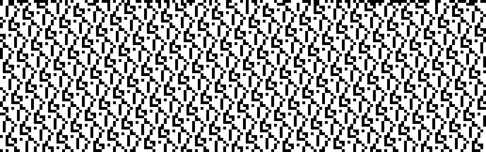

Finally, the blue channel is like the green channel, with this pattern:

```txt
8, 9, 13, 11, 14, 9, 4, 8, 1, 3, 4, 12, 3, 15, 2, 3, 5, 6, 0, 14, 8, 1, 13, 3, 1, 11, 8, 11, 10, 12, 4, 8, 14, 1, 5, 8, 11, 15, 7, 3, 6, 4, 10, 4, 9, 8, 13, 15, 0, 13, 1, 1, 12, 4, 8, 11, 11, 9, 9, 3, 4, 9, 7, 1, 0, 13, 3, 8, 3, 7, 0, 1, 0, 8, 15, 8, 5, 1, 12, 0, 3, 5, 4, 5, 7, 12, 5, 13, 14, 1, 1, 4, 13, 15, 1, 12, 9, 13, 4, 3, 3, 1, 10, 13, 7, 9, 10, 2, 10, 5, 11, 3, 3

length: 113
```

As well as this unique header:

```txt
2, 6, 7, 7, 2, 3, 2, 2, 6, 6, 6, 6, 2, 7, 7, 7, 2, 0, 0, 2, 6, 6, 6, 2, 3, 2, 5, 7, 7, 7, 7, 6, 6, 2, 5, 6, 7, 7, 2, 4, 6, 6, 6, 6, 6, 6, 6, 5, 3, 3, 5, 5, 4, 3, 0, 0, 2, 7, 7, 7, 6, 6, 6, 3, 2, 3, 2, 2, 4, 4, 5, 5, 6, 6, 7, 4, 2, 4, 5, 5, 7, 4, 4, 2, 3, 3, 7, 5, 3, 5, 4, 4, 6, 5, 5, 4, 7, 2, 5, 4, 4, 7, 2, 6, 5, 5, 3, 5, 4, 2, 2, 4, 3, 6, 3, 6, 3, 2, 0, 0, 2, 7, 7, 7, 6, 6, 6, 3, 2, 3, 2, 2, 3, 2, 3, 3, 2, 3, 3, 3, 4, 7, 3, 6, 2, 2, 2, 4, 6, 5, 4, 3, 5, 6, 2, 2, 3, 2, 3, 7, 2, 5, 6, 2, 3, 4, 5, 3, 3, 3, 6, 2, 2, 4, 7, 2, 5, 2, 5, 5, 4, 2, 0, 0, 0, 0, 2, 6, 6, 7, 6, 3, 2, 3, 2, 2, 6, 6, 6, 2, 4, 6, 7, 4, 7, 7, 6, 7, 2, 2, 7, 7, 7, 6, 6, 6, 3, 2, 0, 0, 2, 6, 7, 7, 6, 7, 2, 3, 2, 2, 6, 6, 6, 2, 4, 6, 7, 4, 7, 7, 6, 7, 2, 2, 7, 7, 7, 6, 6, 6, 3, 2, 0, 0, 0, 0, 6, 6, 7, 2, 2, 6, 3, 3, 3, 2, 2, 6, 2, 2, 6, 7, 2, 2, 6, 7, 7, 6, 7, 2, 6, 6, 7, 6, 7, 2, 3, 2, 2, 6, 2, 2, 2, 0, 0, 7, 0, 0, 2, 2, 2, 2, 2, 6, 7, 7, 6, 7, 5, 2, 6, 5, 2, 3, 2, 2, 6, 7, 7, 6, 7, 5, 2, 6, 5, 2, 2, 6, 7, 6, 7, 2, 2, 6, 6, 7, 6, 3, 5, 2, 6, 5, 0, 0, 7, 0, 0, 5, 5, 7, 7, 7, 6, 6, 2, 4, 4, 2, 4, 6, 6, 6, 5, 3, 3, 5, 7, 6, 7, 6, 4, 6, 6, 4, 7, 7, 6, 7, 2, 2, 2, 6, 7, 7, 2, 2, 2, 2, 6, 7, 7, 6, 7, 2, 0, 0

length: 396
```

During the contest, I spent a decent amount of time looking at the repeated part, trying to see if the variations could mean anything, but I didn't get anywhere. However, the fact that the patterns are all different lengths but the green and blue 'header' are both 396 pixels long suggests that maybe the headers are important. After staring at the data for long enough, I realized that the blue header only contains values [0, 7] while the green one is [0, 15]. This means that all the starting pixels in bit plane blue 3 are 0, which we can see if we zoom in again:

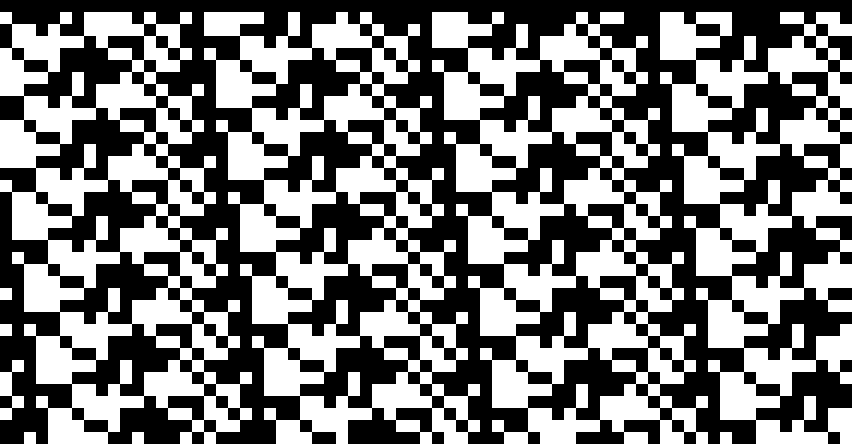

Furthermore, if we look at the actual set of values used, the green contains every value in [0, 15] while blue contains no ones. The frequency of each value provides one final little hint as to what this data might be. Using `collections.Counter(blues[:396])` we get:

```txt
Counter({
  2: 97,  # 0010
  6: 92,  # 0110
  7: 74,  # 0111
  3: 43,  # 0011
  5: 34,  # 0101
  4: 30,  # 0100
  0: 26   # 0000
})
```

Looks like the blue values might be the high bits of ASCII values: the most frequent values are `0010`, which contains symbols and the space character, as well as `0110` and `0111`, which contain the lowercase letters. Notably, there is no `0001`, which contains various control symbols not used in text, and no `1xxx`, which contains unusual extended characters. Basically, whenever you see many bytes starting with `0110`, `0111`, `0100`, and `0101`, you should immediately suspect ASCII.

Since the blue header is probably the high bits of ASCII, we can assume the greens are probably the low bits, so if we combine them using:

```py
print("".join(
    chr((b << 4) | g)
    for b, g in zip(blues[:396], greens[:396])
))
```

We get the output string:

```txt
$out = "flag.txt"
$enc = [system.Text.Encoding]::UTF8
$string1 = "HEYWherE(IS_tNE)50uP?^DId_YOu(]E@t*mY_3RD()B2g3l?"
$string2 = "8,:8+14>Fx0l+$*KjVD>[o*.;+1|*[n&2G^201l&,Mv+_'T_B"

$data1 = $enc.GetBytes($string1)
$bytes = $enc.GetBytes($string2)

for($i=0; $i -lt $bytes.count ; $i++)
{
    $bytes[$i] = $bytes[$i] -bxor $data1[$i]
}
[System.IO.File]::WriteAllBytes("$out", $bytes)
```

Which appears to be some PowerShell code to bitwise xor two UTF-8 strings together. Doing this XOR ourselves, we get the flag.

```py
s1 = "HEYWherE(IS_tNE)50uP?^DId_YOu(]E@t*mY_3RD()B2g3l?"
s2 = "8,:8+14>Fx0l+$*KjVD>[o*.;+1|*[n&2G^201l&,Mv+_'T_B"

print("".join(
    chr(ord(a) ^ ord(b))
    for a, b in zip(s1, s2)
))
```

---

<b id="f1">1</b> An 8 bit png doesn't use red, green, and blue channels like a 24 bit png, but rather an array of 256 different 24 bit colours, called a palette. Each pixel is then just an array index to one of the colours, so it only takes 8 bits. [↩](#a1)
